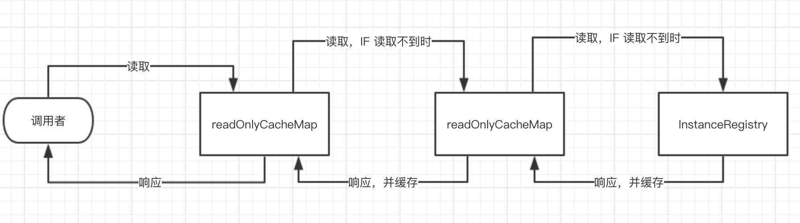

# server端对注册信息的二级缓存设计

- 主动过期：应用实例注册、下线、过期时，只过期readWriteCacheMap
- 定时过期：readWriteCacheMap写入一段时间( 可配置 )后自动过期。
- 被动过期：定时任务对比 readWriteCacheMap 和 readOnlyCacheMap 的缓存值，若不一致，以前者为主。通过这样的方式，实现了 readOnlyCacheMap 的定时过期。

# Eureka选择了AP vs Zookeeper 选择了CP 。
- [为什么不应该使用ZooKeeper做服务发现](http://dockone.io/article/78)

# RW的定时过期
- readWriteCacheMap 使用Guava Cache实现， 配置了Cache过期时间，默认180s
```text
    CacheBuilder.newBuilder().initialCapacity(serverConfig.getInitialCapacityOfResponseCache())
                        .expireAfterWrite(serverConfig.getResponseCacheAutoExpirationInSeconds(), TimeUnit.SECONDS)
```
# RW的主动过期
RW提供了失效接口`ResponseCacheImpl#invalidate`,以下方法（猜：注册、注销、下线、状态变更）调用该接口
- AbstractInstanceRegistry#register(InstanceInfo, int, boolean)
- AbstractInstanceRegistry#internalCancel(String, String, boolean) 
- AbstractInstanceRegistry#deleteStatusOverride(String, String, InstanceStatus, String, boolean)
- AbstractInstanceRegistry#statusUpdate(String, String, InstanceStatus, String, boolean)
# RO的被动过期
ResponseCacheImpl初始化时，创建定时任务：getCacheUpdateTask
- 参数：responseCacheUpdateIntervalMs，默认 30s
- 功能：逐个key对比RW和RO， 以RW为准，set RO

# 缓存的读取流程
- 尝试读RO，没有命中则往下
- 尝试读RW，没有命中则往下
    - 使用Guava cache实现 
    - cache过期参数：ResponseCacheAutoExpirationInSeconds， 180s
- registry中获取，并缓存。
    - 最终调用registr#getApplicationsFromMultipleRegions
    - 就是遍历`ConcurrentHashMap<String, Map<String, Lease<InstanceInfo>>> registry`生成Applications
    - 设置了Applications的`AppsHashCode`,用于client、server的注册校验
```text
CacheBuilder.newBuilder().initialCapacity(1000)
                        .expireAfterWrite(serverConfig.getResponseCacheAutoExpirationInSeconds(), TimeUnit.SECONDS)
                        .removalListener(new RemovalListener<Key, Value>() {
                            @Override
                            public void onRemoval(RemovalNotification<Key, Value> notification) {
                                // TODO[0009]：RemoteRegionRegistry
                                Key removedKey = notification.getKey();
                                if (removedKey.hasRegions()) {
                                    Key cloneWithNoRegions = removedKey.cloneWithoutRegions();
                                    regionSpecificKeys.remove(cloneWithNoRegions, removedKey);
                                }
                            }
                        })
                        .build(new CacheLoader<Key, Value>() {
                            @Override
                            public Value load(Key key) throws Exception {
                                // // TODO[0009]：RemoteRegionRegistry
                                if (key.hasRegions()) {
                                    Key cloneWithNoRegions = key.cloneWithoutRegions();
                                    regionSpecificKeys.put(cloneWithNoRegions, key);
                                }
                                Value value = generatePayload(key);
                                return value;
                            }
                        });
```