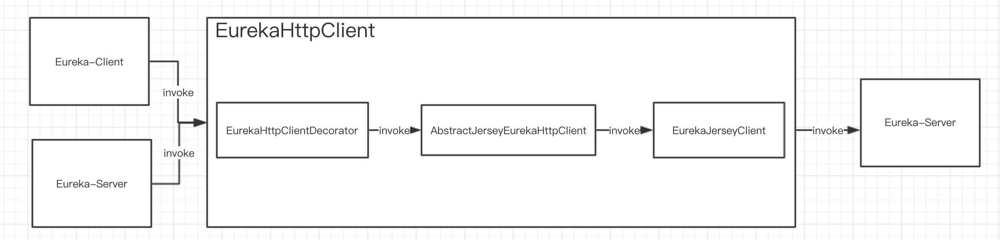

# 场景
Eureka 1.x 主要两部分的网络通信：
- Eureka-Client 请求 Eureka-Server 的网络通信
- Eureka-Server 集群内，Eureka-Server 请求 其它的Eureka-Server 的网络通信
# 代码入口

# 关键类
在 com.netflix.discovery.shared.transport 包下，涉及到主体类
#### EurekaHttpClient 体系EurekaHttpClient
[EurekaHttpClient.uml](pic/EurekaHttpClient.uml)
- EurekaHttpClient： Eureka-Server HTTP 访问客户端，定义了具体的 Eureka-Server API 调用方法
- AbstractJerseyEurekaHttpClient： 基于Jersey框架的EurekaHttpClient
- JerseyApplicationClient、Jersey2ApplicationClient：没啥蛋区别，主体实现都在AbstractJerseyEurekaHttpClient
- EurekaHttpClientDecorator: EurekaHttpClient装饰类，典型的装饰器，为具体实现类提供功能扩展点， 子类实现`EurekaHttpResponse<R> execute(RequestExecutor<R> requestExecutor);`即可
- EurekaHttpClientDecorator各种实现类：提供了会话、重试、重定向、监控指标收集等特性。
    - RetryableEurekaHttpClient：支持向多个 Eureka-Server 请求重试的 EurekaHttpClient 
    - SessionedEurekaHttpClient：执行定期的重建会话，防止一个 Eureka-Client 永远只连接一个特定的 Eureka-Server 。反过来，这也保证了 Eureka-Server 集群变更时，Eureka-Client 对 Eureka-Server 连接的负载均衡。
- EurekaHttpResponse
- EurekaHttpClientFactory：EurekaHttpClient工厂， 只有匿名实现
- TransportClientFactory：EurekaHttpClient工厂， 内部用？
#### HttpReplicationClient
extends from EurekaHttpClient

#### EurekaJerseyClient 体系
该体系： 专门配合JerseyApplicationClient使用
- EurekaJerseyClient 接口
- EurekaJerseyClientImpl 实现

# 代码入口
client初始化：DiscoveryClient#scheduleServerEndpointTask 
- 通信组件：EurekaTransport eurekaTransport，只是简单包裹了EurekaHttpClient，里头分为两种EurekaHttpClient：注册用、查询注册用
- 初始化client：EurekaHttpClients#registrationClientFactory， 生成`Sessioned > Retryable > RedirectingEurekaHttpClient`

# 端点
- 端点 [EurekaEndpoint](pic/EurekaEndpoint.uml)： 服务端点信息， 包括server的url，hostname、 port
- 端点解析器：根据配置获取端点。没那么重要,看看芋道的分析, 用了装饰器模式（然后各种委托）

##  http任务批处理

不同于一般情况下，任务提交了立即同步或异步执行，任务的执行拆分了三层队列：

第一层，接收队列( acceptorQueue )，重新处理队列( reprocessQueue )。
- 蓝线：分发器在收到任务执行请求后，提交到接收队列，任务实际未执行。
- 黄线：执行器的工作线程处理任务失败，将符合条件( 见 「3. 任务处理器」 )的失败任务提交到重新执行队列。

第二层，待执行队列( processingOrder )
- 粉线：接收线程( Runner )将重新执行队列，接收队列提交到待执行队列。

第三层，工作队列( workQueue )
- 粉线：接收线程( Runner )将待执行队列的任务根据参数( maxBatchingSize )将任务合并成批量任务，调度( 提交 )到工作队列。
- 黄线：执行器的工作线程池，一个工作线程可以拉取一个批量任务进行执行。

三层队列的好处：
- 接收队列，避免处理任务的阻塞等待。
- 接收线程( Runner )合并任务，将相同任务编号( 是的，任务是带有编号的 )的任务合并，只执行一次。
- Eureka-Server 为集群同步提供批量操作多个应用实例的接口，一个批量任务可以一次调度接口完成，避免多次调用的开销。当然，这样做的前提是合并任务，这也导致 Eureka-Server 集群之间对应用实例的注册和下线带来更大的延迟。毕竟，Eureka 是在 CAP 之间，选择了
