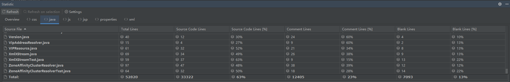

# What is Eureka
[Eureka-at-a-glance](https://github.com/Netflix/eureka/wiki/Eureka-at-a-glance)
```text
Eureka is a REST (Representational State Transfer) based service that is primarily used in the AWS cloud 
for locating services for the purpose of load balancing and failover of middle-tier servers. We call this service, the Eureka Server. 
Eureka also comes with a Java-based client component,the Eureka Client, which makes interactions with the service much easier. 
```
- 关键词：locating services、load balancing and failover、Resilience、monitor
- 其次：这个项目已经停止维护。2.x已经不继续开发，但是3w代码学习注册中心的设计与实现，很划算，最终还是看看nacos

# 基本架构


# java代码3w行, 操之


# 包结构
- eureka-client： Eureka-Client 的功能实现
- eureka-client-archaius2：Archaius 是 Netflix 开源的配置管理组件， 盲猜是client的可配置功能增强
- eureka-client-jersey2：Jersey 是 JAX-RS（JSR311）开源参考实现，用于构建 RESTful Web Service。使用场景大概是：[serverless的边车](https://github.com/Netflix/eureka/wiki/Eureka-at-a-glance#non-java-services-and-clients)
    - Eureka-Server 使用 Jersey Server 创建 RESTful Server
    - Eureka-Client 使用 Jersey Client 请求 Eureka-Server
- eureka-core：Eureka-Server的核心功能实现
- eureka-core-jersey2：给Eureka-Server的核心功能包裹一层Rest协议。使用场景大概是：[serverless的边车](https://github.com/Netflix/eureka/wiki/Eureka-at-a-glance#non-java-services-and-clients)
- eureka-resources： Eureka-Server 的运维后台界面，JSP做的
- eureka-server：整合了eureka-core、eureka-resources
- eureka-server-governator：使用 Netflix Governator 管理 Eureka-Server 的生命周期。*大概率就不看这个模块*
- eureka-examples： 用例，当做阅读入口
- eureka-test-utils：单元测试


# Q
- 流程：server端启动
- 流程：server组集群：相互之间注册？
- 流程：client注册、心跳
- 流程：client的服务注册
- 流程：client的服务定位(如何lb、 如何failover)
- 流程：client保护模式
- 特性：指标监控
- 特性：可配置
- 特性：弹性
```text
Eureka clients are built to handle the failure of one or more Eureka servers. 
Since Eureka clients have the registry cache information in them, they can operate reasonably well, even when all of the eureka servers go down.

Eureka Servers are resilient to other eureka peers going down. 
Even during a network partition between the clients and servers, the servers have built-in resiliency to prevent a large scale outage.
```
- 场景：参考[How is Eureka used at Netflix?](https://github.com/Netflix/eureka/wiki/Eureka-at-a-glance#how-is-eureka-used-at-netflix)
- 优秀技术亮点：关键实现、底层工业级实现、设计模式
```text
技术出现的背景与初衷，解决什么问题
技术的优劣是什么，即tradeoff
技术的适用场景（技术场景、业务场景）
技术的组成部分与关键点：了解技术的核心思想、核心组件
技术的底层原理和关键实现：底层的关键基础技术，很可能是其他类似方案的关键基础技术
已有实现和它之间的对比：不同的实现会有不同的侧重点，对比可以得到不同的想法和思路
```


# 调试
拉起server：EurekaClientServerRestIntegrationTest 任一test方法,服务会被拉起
拉起client：ExampleEurekaClient#main